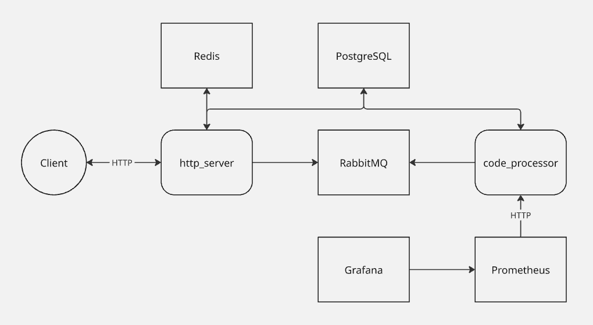

# Code Processor

Асинхронный сервис, позволяющий безопасно компилировать и запускать пользовательский код и
получать вывод с stdout, stderr.  
Для обеспечения безопасности на сервере разворачивается Docker-контейнер из образа, содержащий
код. Ресурсы контейнера ограничены разумным образом.

## Используемые технологии

* Golang
* Python
* go-chi
* PostgreSQL
* Redis
* RabbitMQ
* Swagger
* Docker

## API

Имеется Swagger-документация API. UI доступен в браузере на эндпойнте ```/swagger/index.html```.  
По умолчанию для клиентских запросов прослушивается порт 8080. Изменить его можно в файле конфигурации сервиса **http_server**.

## Запуск

Сборка всех сервисов и их развертывание через Docker Compose:

```bash
make launch_services
```

Сборка всех сервисов, их развертывание через Docker Compose и запуск интеграционных тестов:

```bash
make launch_services_with_tests
```

Остановка всех сервисов и удаление контейнеров:

```bash
make stop_services
```

## Архитектура

Асинхронность достигается путем отправки байтового массива с кодом в RabbitMQ и обработки на
другой стороне отдельным микросервисом (после которой результат кладется в базу данных).

* **http_server** – сервис, принимающие клиентские HTTP запросы
* **code_processor** – сервис, компилирующий и запускающий пользовательский код

Данные о пользователях и программах хранятся в PostgreSQL. Redis используется для хранения информации о пользовательских сессиях.  
В целях интерпретируемой аналитики настроены сбор метрик в Prometheus (загрузка исполняющего
микросервиса, время работы программ) и их визуализация в Grafana (на главном дашборде). По умолчанию Grafana доступна на порту 3000 (логин "admin", пароль "adminpass").


